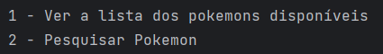
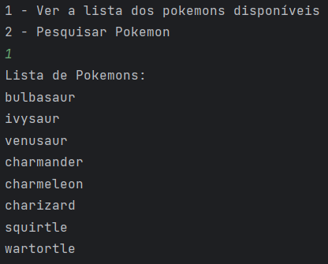
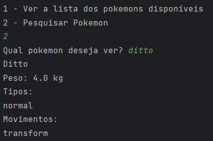

<h1> ConsumoPokeapi</h1>

This project was created to train my knowledge in python dealing with data from an external api and using (OOP) object-oriented programming.

<h2>Running</h2>
<ul>
    <li>Run `pip install -r requirements.txt` to install the packages</li>
    <li>Run `py app,py`</li>
</ul>

After following these steps, the script will start from the menu:

Selecting option 1 will bring up a list of the pokemons available for the search:

Selecting option 1 will bring up a list of the pokemons available for the search:

